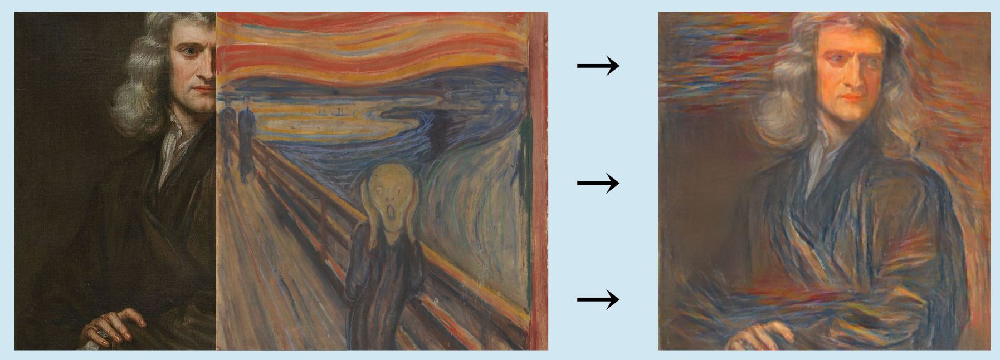

<a id="readme-top"></a>

<div align="center"> 
    <h1 align="center">Convolutional neural network style transfer analysis</h1> 
    <p align="center"> <br /> 
        <a href="https://github.com/lazarnagulov/cnn-style-transfer-analysis/issues/new?labels=bug">Report Bug</a> 
    </p> 
</div> 

## About The Project

This project explores how convolutional neural networks represent visual information at different network depths, using Neural Style Transfer (NST) as an analytical tool.



The implementation follows the method proposed by Gatys et al. (2015), using a pretrained VGG19 network with frozen weights. Optimization is performed directly on the input image by minimizing a weighted combination of content and style loss, where style is represented via Gram matrices of selected layer activations. L-BFGS is used as the optimizer.


## Getting Started
Before running the project, ensure you have Python 3.10+ installed.

Check your version:
```bash
python --version
```

###  Installation Steps
1. Clone the repository:
```bash
git clone https://github.com/lazarnagulov/cnn-style-transfer-analysis.git
cd cnn-style-transfer-analysis
```
2. Create and activate virtual environment (optional but recommended):
```bash
python -m venv venv
source venv/bin/activate   # Linux / macOS
venv\Scripts\activate      # Windows
```
3.  Install dependencies:

#### Option A – CPU-only (any system)
Install shared dependencies and CPU PyTorch:
```bash
pip install -r requirements.txt
pip install -r requirements_cpu.txt
```
#### Option B – GPU / CUDA users

1. Skip installing CPU PyTorch. If previously installed, uninstall it:
```bash
pip uninstall torch torchvision -y
```
2. Install GPU-enabled PyTorch. For example, for CUDA 13.0 / RTX 3060:
```bash
pip install torch torchvision --index-url https://download.pytorch.org/whl/cu130
```
3. Install other dependencies:
```bash
pip install -r requirements.txt
```
4. Verify GPU installation
```python
import torch
print("PyTorch version:", torch.__version__)
print("CUDA available:", torch.cuda.is_available())
if torch.cuda.is_available():
    print("GPU device:", torch.cuda.get_device_name(0))
```
Expected output for a CUDA setup:
```
PyTorch version: 2.9.1+cu130
CUDA available: True
GPU device: NVIDIA GeForce RTX 3060
```
If `CUDA available` is True, your Neural Style Transfer will automatically run on the GPU, dramatically speeding up training.
<br/>

## Academic Poster

The academic poster associated with this project is available here:

[View Poster (PDF)](./docs/poster.png)

You can also find it in the `docs/` directory.

## Running Experiments

The project uses a configuration system (`ExperimentConfig`) which supports both YAML files and command-line arguments (CLI). 

1. Using a YAML configuration file
```yaml
content_image: ./data/content/sir_isaac_newton.jpg
style_image: ./data/style/the_scream.jpg
output_path: ./results
image_size: 512
steps: 100
alpha: 1.0
beta: 1000000.0
content_layers:
  - conv4_2

style_layers:
  - conv1_1
  - conv2_1
  - conv3_1
  - conv4_1
  - conv5_1
```
Run the experiment using the YAML file:
```bash
python ./src/main.py --config ./configs/config_example.yaml
```

2. Using command-line arguments directly

You can override any parameter directly via CLI without a YAML file:
```bash
python ./src/main.py \
    --content_image ./data/content/sir_isaac_newton.jpg \
    --style_image ./data/style/the_scream.jpg \
    --output_path ./results/output.jpg \
    --image_size 512 \
    --steps 400 \
    --alpha 1.0 \
    --beta 1000000.0 \
    --content_layers conv4_2 \
    --style_layers conv1_1 conv2_1 conv3_1 conv4_1 conv5_1 \
```
> Note: CLI arguments will override any values defined in a YAML configuration.

All stylized images are saved to the location specified by output_path (default is inside ./results/).

## References
- Gatys, L. A., Ecker, A. S., & Bethge, M. (2015). A Neural Algorithm of Artistic Style.